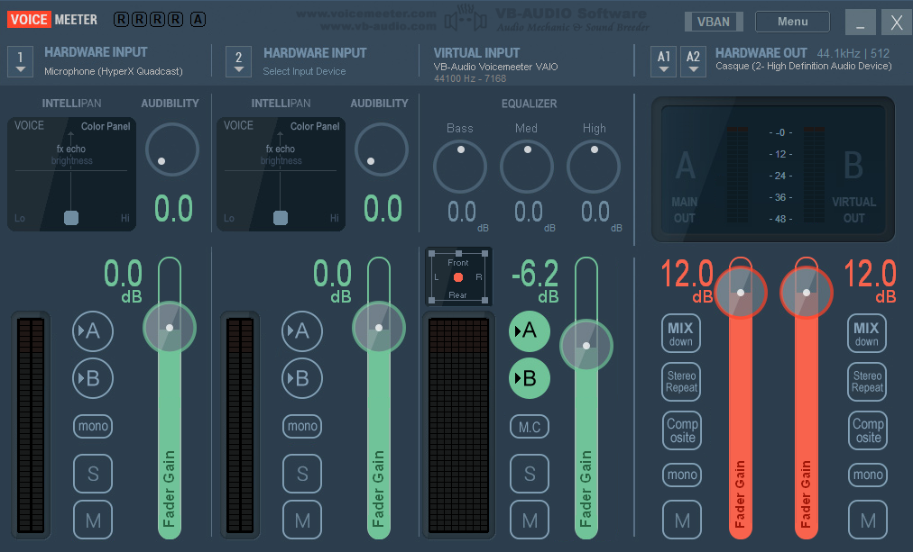

# Twitch subtitle bot

This is a twitch bot creates subtitles for a twitch streams and sends them in the chat.

## Usage

To make this bot work, you will first need to download [Voicemeeter](https://vb-audio.com/Voicemeeter/) and have your settings look like 
You will also need to make Microsoft Word your default application for .txt files and make Microsoft Word save files as .txt instead of .docx. A shortcut to the channel.txt file on your desktop.

I did not want to pay a lot of money for a good speech to text api like google's so instead I am using Word's integrated speech to text and an auto clicker. Unfortunately if you want this bot to work you will need to adapt the coordinates of the click from the auto clicker. I wrote down comments describing what all of the different clicks do.

Finally, you will need to get yourself a [Twitch OAuth token](https://twitchapps.com/tmi/) and [token for the Twitch API](https://twitchtokengenerator.com/)

## Contributing
If anyone is willing to help make this bot not require an auto clicker, it would be very appreciated!

## License
[MIT](https://choosealicense.com/licenses/gpl-3.0/)